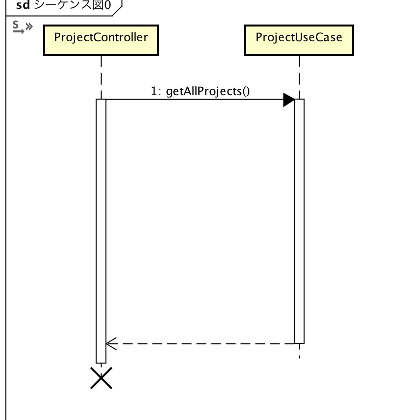
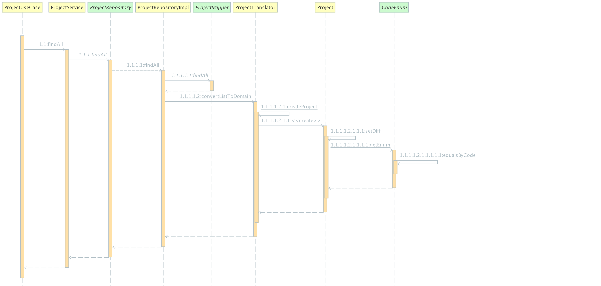

# 詳細設計：プロジェクト一覧取得API

## 処理概要

DBに登録されている全部のプロジェクトを取得する

## 利用するSQL

```SQL
SELECT project_id, project_nm, dept_id, difficulty FROM PROJECT
```

## シーケンス図

(なぜかControllerから生成できないため、分けて書く)

#### ProjectController



#### ProjectUseCase以降



